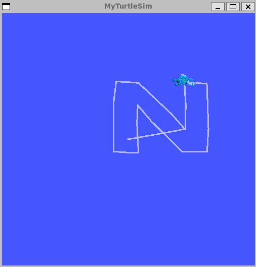

# Advanced Robotics - Project 1 Deliverable 2
This workspace includes the well-known ROS package `turtlesim` along with a custom package that enables the turtle to trace the letter **'N'** in honor of NC State.

## Dependencies
* ROS2 Jazzy
* Python3

## Setup

1) Source ROS2
    ```
    source /opt/ros/jazzy/setup.bash
    ```

2) Build
    ```
    cd ./drawN_ws
    colcon build
    ```

## How to Run
1) Source Package
    ```
    source install/setup.bash
    ```

2) Run Turtle Sim
    ```
    ros2 run turtlesim turtlesim_node
    ```

3) Run Custom Package
    ```
    ros2 run P1D2_hayden_cameron P1D2_hayden_cameron
    ```

## Result
