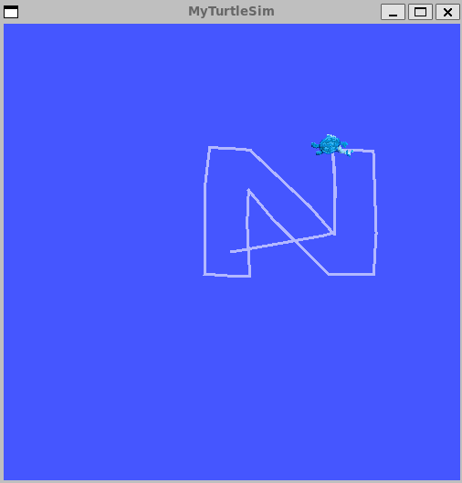

# Turtle Sim Draw N
This workspace contains a custom ROS 2 package that enables the classic [turtlesim](https://docs.ros.org/en/jazzy/Tutorials/Beginner-CLI-Tools/Introducing-Turtlesim/Introducing-Turtlesim.html)
simulator to trace the letter **“N”**, representing **NC State University**.

## Dependencies
* [ROS2 Jazzy](https://docs.ros.org/en/jazzy/Installation.html)
* Python3
* Turtlesim (ros-jazzy-turtlesim)

To install turtlesim:
```bash
sudo apt update
sudo apt install ros-jazzy-turtlesim
```

## Setup
```bash
# Source ROS2 Jazzy
source /opt/ros/jazzy/setup.bash

# Build the workspace
colcon build --symlink-install
```

## How to Run
You’ll need two terminal windows — one for the turtlesim_node and one for your custom node.

1) In the first terminal, source ROS 2 and your workspace, then start TurtleSim:
    ```bash
    source /opt/ros/jazzy/setup.bash
    source install/setup.bash
    ros2 run turtlesim turtlesim_node
    ```

2) In a second terminal, source again and run the custom package:
    ```bash
    source /opt/ros/jazzy/setup.bash
    source install/setup.bash
    ros2 run turtlesim_draw_n turtlesim_draw_n
    ```

## Result
The Turtle will trace the letter N as shown below:

